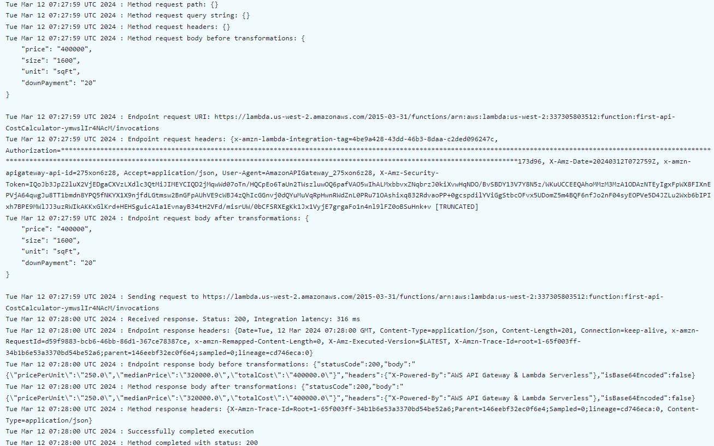

<p align="center">
  <h1 align="center"><b> API with OpenAPI & AWS SAM </b></h1>
</p>


<details open="open">
  <summary><h2 style="display: inline-block">Project Details</h2></summary>
  <ol>
    <li><a href="#readme-goal">ReadMe Goal</a>
    <li><a href="#tech-stack">Tech Stack</a>
    </li>
    <li><a href="#project-description">Project Description</a></li>
    <li><a href="#sam-cli">SAM CLI</a></li>    
    <li><a href="#lambda-function">Lambda Function</a></li>
    <li><a href="#api-gateway">API Gateway</a></li>
    <li><a href="#javascript">JavaScript</a></li>
    <li><a href="#sam-local-invoke">SAM Local Invoke</a></li>
    <li><a href="#github-actions">Github Actions</a></li>
    <li><a href="#unit-testing">Unit Testing</a></li>
    <li><a href="#integration-testing">Integration Testing</a></li>
    <li><a href="#improvements">Improvements</a></li>
    <li><a href="#challenges-closing">Challenges & Closing</a></li>
    <li><a href="#acknowledgements">Acknowledgements</a></li>
  </ol>
</details>


### ReadMe Goal
---------------------
The goal of this readme is to serve as a guide for others willing to build something similar. Whenever I am working on a project or following along with a tutorial, I always try to add my own twist. So if you're looking to follow along, hope you have your troubleshooting hats on because this is not your usual step-by-step guide. I am going to create a `Challenge` section where I'll turn all the issues I encountered into their own mini challenges. It wont be anything too complex..hopefully


### Tech Stack
------------------
- AWS SAM
- DynamoDB
- AWS Lambda
- API Gateway
- JavaScript
- GitHub Actions (CI/CD) using SAM Pipelines


### Project Description
-----------------
This is the [TBD]


### Lambda
The functions defined in this repo are Lambda functions


## Trouble Shooting
### Problem Fix
```bash
"CloudWatch Logs role  
ARN must be set in     
account settings to    
enable logging         
(Service: ApiGateway,  
Status Code: 400,      
Request ID: 4b2ae96e-  
27d4-433b-948d-4f933a05499)"         
(RequestToken: eb3dab7 
c-86f8-06e5-35a7-fa1a1e2b1e65,          
HandlerErrorCode:      
InvalidRequest) 
```

<table>
  <tr>
    <th>Problem</th>
    <th>Solution</th>
  </tr>
  <tr>
    <td><code>CloudWatch Logs role ARN must be set in account settings to enable logging</code></td>
    <td><code>https://repost.aws/knowledge-center/api-gateway-cloudwatch-logs</code></td>
  </tr>
  <tr>
    <td><code>File with same data already exists at first-api/760ba5cba701dfdebe1c5b2edb6757b6.template, skipping upload </code></td>
    <td><code>Delete the stack using either `aws cli` or the console</code></td>
  </tr>
  <tr>
    <td><code>All the above</code></td>
    <td>  <a href="https://github.com/coolchigi/Cloud-Projects/blob/main/openapi-sam/template.yaml"><code>template.yaml</code></a></td>
  </tr>
</table>


### Api Gateway
....
#### Test Your API
```json
{
    "price": "400000",
    "size": "1600",
    "unit": "sqFt",
    "downPayment": "20"
}
```
----
<h1>Result</h1>
